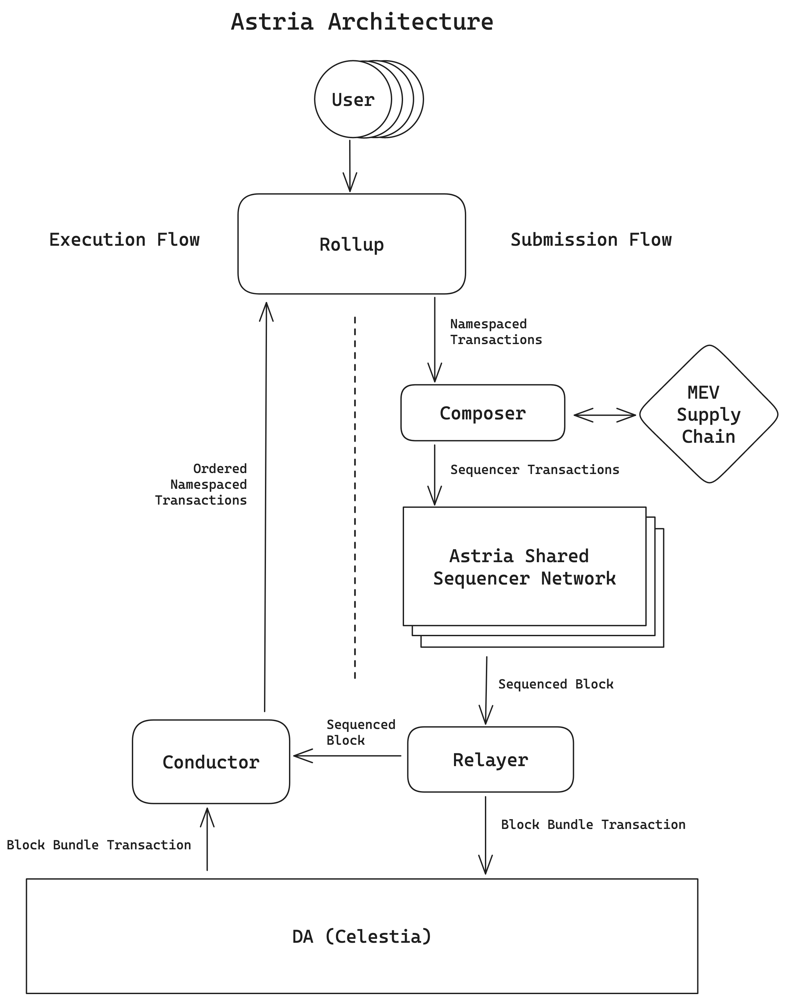
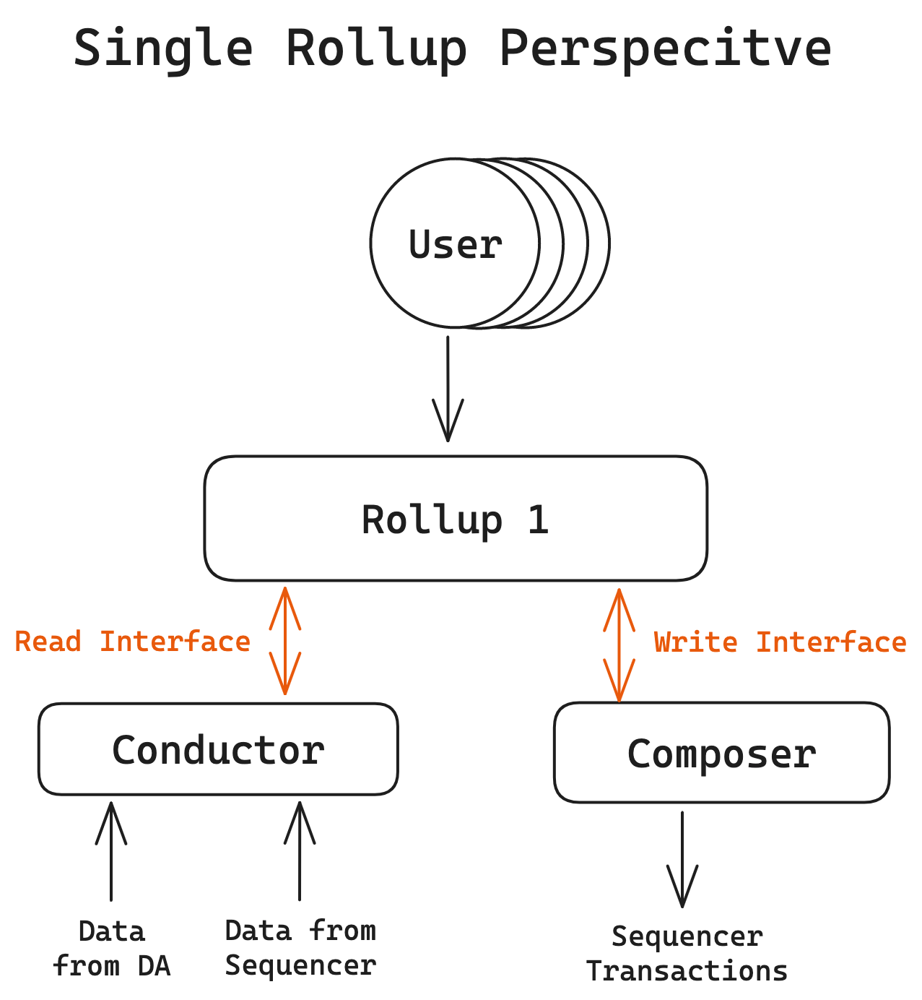
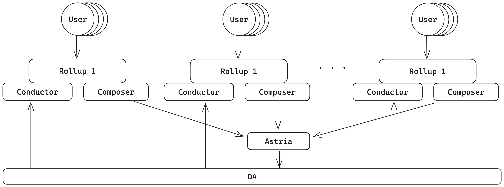

# [Astria](https://www.astria.org/): Decentralized by Default
 - [The Astria dev-cluster](#the-astria-dev-cluster)
 - [Architecture](#architecture)
    - [Users](#users)
    - [Rollups](#rollups)
    - [Composer (under construction)](#composer-under-construction)
    - [The Shared Sequencer](#the-shared-sequencer)
    - [Relayer](#relayer)
    - [Data Availability](#data-availability)
    - [Conductor](#conductor)
 - [Running the Cluster](#running-the-cluster)
    - [Installation](#installation)
    - [Deployment](#deployment)
    - [Faucet and Block Explorer](#faucet-block-explorer-and-test-data)
    - [Multiple Rollups](#run-multiple-rollups)
    - [What's Going on Under the Hood?](#whats-going-on-under-the-hood)
 - [Summary](#summary)

## The Astria [dev-cluster](https://github.com/astriaorg/dev-cluster)
Astria's Shared Sequencer Network allows multiple rollups to share a single decentralized network of sequencers that’s permissionless to join. This shared sequencer network provides out-of-the-box censorship resistance, fast block confirmations, and atomic cross-rollup inclusion guarantees.

The Astria dev-cluster is the collective stack of all of Astria's components packaged together using Kubernetes. While we generally refer to Astria as the network of shared sequencers, we provide several other components to make it simpler to integrate with the shared sequencer network. The dev-cluster is provided to make developing and testing the Astria network, as well as integrations with Astria, as simple as possible.

This document outlines what each of the components in the dev-cluster do, and provides instructions for how to run the dev cluster locally.

## Architecture
At a high level, Astria breaks out all of the components that are historically combined together in monolithic blockchains into individual components. This results in a modular ecosystem that allows users to swap out components to fit their specific needs.


The diagram above shows a Decentralized Rollup w/ Astria Architecture. Each component is explained in more detail below.

### Users
One of Astria's goals is to provide rollups with fast finality, atomic cross-rollup inclusion, and decentralization out of the box, without requiring changes to their end user experience. Individual rollups should be able to provide a native experience to their users, Metamask should "just work" with an EVM rollup, and Keplr should "just work" with a cosmos-sdk rollup.

### Rollups
Astria is designed for permissionless rollup integration and takes advantage of lazy shared sequencing. This means that rollup developers have total sovereignty over their own execution state and can swap out sequencing layers without fear of being locked in. You do not need to ask for permission or go through a governance process to gain access. A rollup simply needs to satisfy the following interfaces:
1. Write Interface (Rollup <-> Composer):
    - For transaction submissions.
2. Read Interface (Rollup <-> Conductor):
    - For receiving blocks from the shared sequencer network.

The [Composer](#composer) and [Conductor](#conductor) are explained in more detail in future sections.


Both composer and conductor expose [gRPC](https://grpc.io/) interfaces. See the [astria-protos](https://github.com/astriaorg/astria/tree/main/crates/astria-proto) repo for specific implementation details.

The current dev-cluster deploys a fork of [Geth](https://github.com/astriaorg/go-ethereum) as an EVM rollup. 

### Composer 
The Composer is an in-house abstraction over the potential actors in Astria's
MEV supply chain. It currently contains a naive implementations of the role a
searcher will fulfill, with the intention of having working examples that
economically incentivized third parties can use as a starting point for their
own implementations. As we progress from design to implementation of Astria's
proposer-builder separation it will also include an example implementation of a
naive builder. The abstractions serves the goal of acting as a forcing function
on our architecture design by stubbing out the roles and requiring other
components to interact with them through an interface.

While a real searcher implementation would create profit-generating bundles of rollup transactions and submit them to a builder, the Composer implementation simply bundles every rollup transaction it receives into a sequencer transaction and submits it to the sequencer. As our approach to proposer-builder separation is still in its design phase, there is currently no explicit builder role in the MEV supply chain and transactions are submitted directly to validator nodes' CometBFT mempool.

Once Astria's block builder design moves to its implementation phase, the Composer will include a reference builder implementation as well. Similarly to the searcher, while a real builder implementation would run a profit-generating auction, the composer implementation will simply run a FIFO queue that will add all the sequencer transactions it receives and submits a block to the sequencer's proposer.

Once Astria's block builder design moves to its implementation phase, the Composer will include a reference builder implementation as well. Similarly to the searcher, while a real builder implementation would run a profit-generating auction, the composer implementation will simply run a FIFO queue that will add all the sequencer transactions it receives and submits a block to the sequencer's proposer.

### The Shared Sequencer
The Astria Shared Sequencer is a decentralized network of nodes utilizing CometBFT that come to consensus on an ordered set of transactions (ie. it is a blockchain). The unique feature of the sequencer is that the transactions it includes are not executed (lazy sequencing), and are destined for another execution engine (ie. a rollup). This excludes “sequencer native” transactions, such as transfers of tokens within the sequencer chain. Transactions from any given rollup are only ordered on the sequencer, not executed.

The sequencer can optionally act as a “validator”, meaning it actively participates in the production and finalization of new blocks.

### Relayer
The Relayer's responsibility is to take validated blocks from the sequencer and pass them along to both the Conductor and the DA layer. Because the sequencer's block times are much faster than those of the DA, the relayer also collects a queue of sequencer blocks before wrapping them for submission to DA.

The individual sequencer blocks are sent immediately to the Conductor to enable fast finality for an improved UX and also act as soft commits for the execution layer. The collections of blocks sent to the DA layer are used as a source of truth and are ultimately pulled from the DA to be used as firm commits for finality in the rolllups.

### Data Availability
The dev-cluster uses [Celestia](https://github.com/celestiaorg) as the data availability layer and is the ultimate destination of all data that has been ordered by the sequencer network. Once written to Celestia, the transaction order is considered final and it is where all data will be pulled from if you need to spin up a new rollup node.

### Conductor
Conductor's role is to drive the deterministic execution of sequencer blocks to rollups. It abstracts away the logic required to read data from DA and Sequencer, tracking firm and soft commitments, block and header shapes, as well as verification of the data. The rollup implements the Execution API server, and runs conductor alongside to drive deterministic execution. The Conductor is effectively stateless but does ephemerally store some information about the blocks it has seen and passed on to be executed. It primarily filters the transactions that are relevant to a given rollup out of the sequencer blocks for execution. The data that it does store is for sending commitment updates to the rollup.
As mentioned in the Relayer section above, any data received by the Conductor directly from the Relayer is considered a soft commit. This data is filtered using the rollup's namespace and only transactions that are relevant to the rollup are passed on as blocks for execution. These blocks are also marked as "safe". The Conductor regularly polls Celestia for new data and when it sees the same blocks in Celestia that it has already seen from the Relayer, it sends a firm commit message to the rollup to update that block to "finalized."

## Running the Cluster

### Installation
You will need to pull both the [dev-cluster](https://github.com/astriaorg/dev-cluster) and [astria-web3](https://github.com/astriaorg/astria-web3) repos from our github.

Install the necessary dependencies and tools listed for each repo.

### Deployment
To deploy the full dev-cluster, open a terminal in the dev-cluster directory and run the command: 
```
just deploy-all-local
```

This may take a minute or two if this the first time you are deploying as quite a few containers need to be downloaded. Once the command completes, all elements of the dev-cluster will be up and running including a geth rollup, faucet and block explorer. 

At this stage you will have the full dev-cluster running with one rollup.

### Faucet, Block Explorer, and Test Data
With the dev-cluster running, you can access the block explorer and faucet by opening a couple new windows in your browser and going to to the following urls.
For the block explorer:
```
http://blockscout.astria.localdev.me/
```
For the faucet:
```
http://faucet.astria.localdev.me/
```

You can copy and paste a wallet address on the faucet page and give yourself 1 RIA. 

To test out the block explorer, open a terminal in the astria-web3 repo you downloaded earlier and navigate to the `packages/evm-test-data/` and run the following command:
```
just generate-transactions
```
You can now go back to your browser and pull up the block explorer and you will now see blocks with transactions getting created in real time.

### Run Multiple Rollups
At Astria we believe strongly that deploying a rollup should be as easy as deploying a smart contract. The dev-cluster shows this is indeed possible.

Navigate back to the dev-cluster repo and run the following command with your own rollup name and network id:
**NOTE:** The default rollup name and network id are `astria` and `912559`. When deploying your second rollup you ___must___ use a different name and number.
```
just deploy-rollup <rollup_name> <network_id>
```
As before it will take a moment for everything to spin up, but in the meantime keep the the rollup name and network id handy and navigate back to your browser and open a new window with the following url, replacing `rollup_name` with the name you just used to deploy your new rollup:
```
http://blockscout.<rollup_name>.localdev.me/
```
Once everything has spin up you will see a new block explorer for your new rollup.

You can now deploy transaction to that rollup independently.
In the `evm-test-data` directory open a new terminal and run the following:
```
just generate-transactions <rollup_name> <network_id>
```
As before, this command will deploy test transaction data to your new rollup.
You can also go back to your original terminal window for the test data deployment on the default rollup and rerun the `just generate-transactions` command. If you switch back and forth between the default block explorer window and your new rollup window, you will see transactions showing up on each rollup independently!

The only limitations to running numerous rollups are the following:
 - Can your hardware handle it
 - There are no rollup name and network id clashes

### What's Going on Under the Hood?
One last thing to mention is what is actually happening when you deploy a new rollup in the dev-cluster. When you you deploy a new rollup the only new containers that are getting spun up in the cluster are a new rollup node, a conductor, block explorer, and faucet. Only one instance of the shared sequencer and the DA layer remain running and the transactions from all the rollups are collectively getting run though those networks. This can be shown in the following diagram:


## Summary
Hopefully this document helped shed some light on the inner workings of the Astria dev-cluster. Check us out on [Twitter](https://twitter.com/AstriaOrg), [github](https://github.com/astriaorg), and our [website](stria.org).
